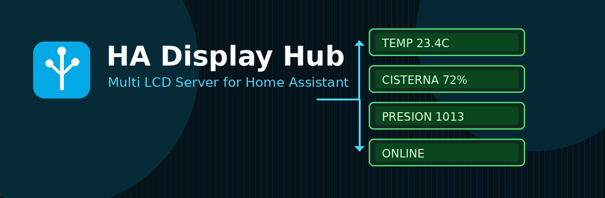
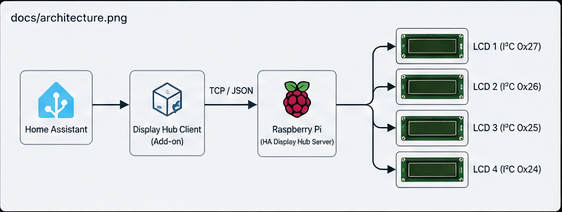
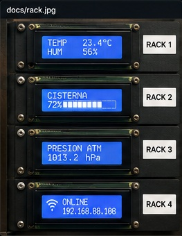
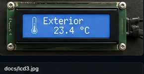
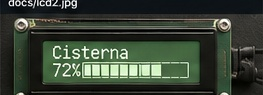
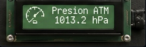
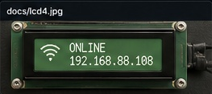

# HA Display Hub



**HA Display Hub** is a lightweight TCP/JSON display server for Raspberry Pi and Linux devices.  
It lets Home Assistant, scripts, Node-RED or any other client control multiple physical displays connected to a central Raspberry Pi.

The first supported hardware target is the classic **HD44780 16x2 LCD** using **PCF8574 I²C backpack adapters**.

---

## Features

- TCP server using newline-delimited JSON
- Multiple independent displays
- HD44780 LCD support through I²C / PCF8574
- Multiple LCDs on the same I²C bus
- Simple `display`, `clear`, `ping` and `info` commands
- Systemd service support
- Lightweight Python implementation
- Designed for headless Raspberry Pi installations

---

## Architecture



```text
Home Assistant
      |
      | TCP / JSON
      v
HA Display Hub Server
      |
      | I2C
      +-- LCD rack1 0x27
      +-- LCD rack2 0x26
      +-- LCD rack3 0x25
      +-- LCD rack4 0x24
```

---

## Hardware example



Tested with:

- Raspberry Pi 3
- Raspberry Pi OS Lite
- HD44780 16x2 LCD modules
- PCF8574 I²C backpack adapters
- I²C bus 1
- Different addresses per display, for example `0x27`, `0x26`, `0x25`, `0x24`

> If several LCDs are connected to the same I²C bus, each backpack must have a unique address.

---

## Installation

Clone the repository on the Raspberry Pi:

```bash
git clone https://github.com/nicocalvagna/ha-display-hub.git
cd ha-display-hub
```

Install dependencies:

```bash
python3 -m venv .venv
source .venv/bin/activate
pip install -r requirements.txt
```

Copy the example configuration:

```bash
cp examples/config.yaml config.yaml
```

Run manually:

```bash
python server/display_server.py -c config.yaml
```

Install as a service:

```bash
chmod +x install.sh
./install.sh
sudo systemctl enable --now ha-display-hub
```

Check status:

```bash
systemctl status ha-display-hub
```

---

## Configuration

Example `config.yaml`:

```yaml
server:
  listen: "0.0.0.0"
  port: 4510

displays:
  - id: "rack1"
    driver: "hd44780_i2c"
    bus: 1
    address: 0x27
    width: 16
    height: 2

  - id: "rack2"
    driver: "hd44780_i2c"
    bus: 1
    address: 0x26
    width: 16
    height: 2
```

---

## Protocol

HA Display Hub uses TCP with one JSON object per line.

### Ping

```bash
echo '{"cmd":"ping"}' | nc 192.168.88.108 4510
```

Response:

```json
{"status":"ok","message":"pong"}
```

### Info

```bash
echo '{"cmd":"info"}' | nc 192.168.88.108 4510
```

### Display text

```bash
echo '{"cmd":"display","target":"rack1","lines":["Exterior","23.4 C"]}' | nc 192.168.88.108 4510
```

### Clear display

```bash
echo '{"cmd":"clear","target":"rack1"}' | nc 192.168.88.108 4510
```

---

## Screenshots

| Exterior | Cisterna |
|---|---|
|  |  |

| Pressure | Online |
|---|---|
|  |  |

---

## Roadmap

- [x] TCP/JSON server
- [x] Mock display driver
- [x] HD44780 I²C driver
- [x] Multiple displays on one bus
- [x] Home Assistant add-on client
- [ ] Custom icons through CGRAM
- [ ] Backlight control
- [ ] 20x4 LCD support improvements
- [ ] OLED support
- [ ] MQTT bridge

---

## Related project

Home Assistant client add-on:

- [HA Display Hub Client](https://github.com/nicocalvagna/ha-displayhub-client)

---

## License

MIT
